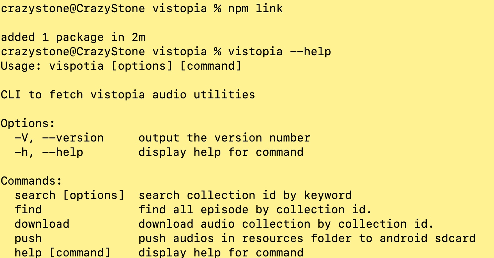
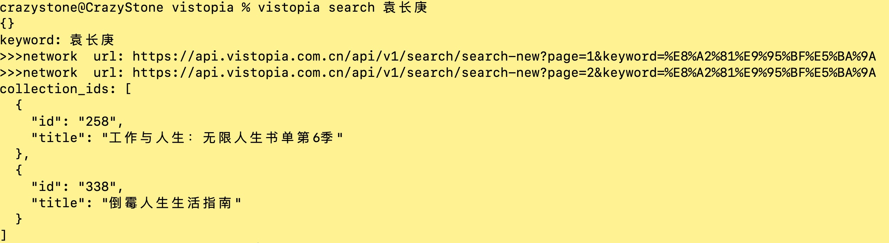
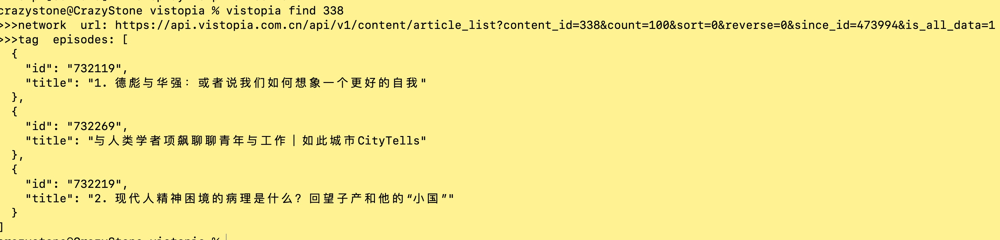
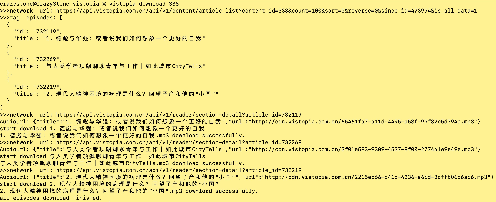

## 看理想音频抓取工具

### 环境
>$ nmp install

### 编译  
>$ npm run build

### 使用
>$ npm link  

- 成功如下：
  

**搜索**
>$ vistopia search <keyword>

**通过`collection id`获取`epsoide`列表**
>$ vistopia find <collection_id>

**下载**
>$ vistopia download <collection_id>

**push to phone**
>$ vistopia push
